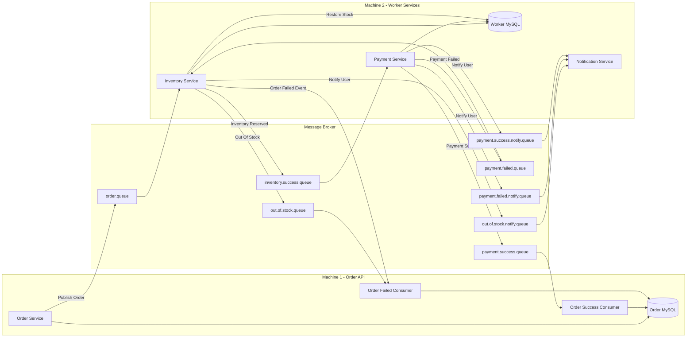

# queue-x — Async Order Processing System

A production-grade async order processing system built with Spring Boot, demonstrating event-driven architecture, the outbox pattern, idempotency, and saga-style compensation across two independent services.

> **Worker service repo:** [queue-x-workers](https://github.com/KeyurWarkhedkar/queue-x-workers)

---

## Architecture

```
Client
  ↓ POST /orders
Order Service (port 8080)
  → saves order + outbox row (same transaction)
  → outbox poller publishes to Redis queue
  ↓ order_queue
Worker Service (port 8081)
  → inventory check (atomic decrement)
  → payment processing (3 retries, exponential backoff)
  → notification emails
  → publishes status events back to order service
  ↓
Order Service consumers
  → marks order COMPLETED or FAILED
```



### Key design decisions

**Outbox pattern** — order and outbox row are written in the same transaction. A scheduled poller publishes to Redis after commit. This guarantees no message is lost even if the service crashes after the DB write.

**Idempotency at every layer** — the API deduplicates client retries via a unique constraint on `idempotency_key`. Workers use a blind INSERT into an idempotency table to prevent duplicate message processing. Both guards use DB constraints as the real safety net, not application-level checks.

**Saga compensation** — inventory is reserved before payment. If payment fails after retries are exhausted, a compensating transaction releases the stock. This avoids calling the payment gateway for a refund.

**Race condition safety** — concurrent order creation with the same idempotency key is handled by catching `DataIntegrityViolationException` on the unique constraint, not by a check-then-insert pattern which would have a race window.

**SKIP LOCKED polling** — the outbox poller uses `SELECT FOR UPDATE SKIP LOCKED` so multiple instances never compete for the same rows, eliminating deadlock risk under concurrent polling.

---

## Tech stack

- Java 21 · Spring Boot 3
- MySQL (Postgres compatible)
- Redis (message queue via LPUSH/BLPOP)
- Spring Data JPA · Hibernate
- Spring Scheduling (outbox poller, status consumers)
- K6 (load testing)

---

## API

### POST /orders

Creates an order and immediately returns. Payment and inventory processing happen asynchronously via the worker service.

**Request**
```json
{
  "userId": 1,
  "productId": 1,
  "quantity": 2,
  "idempotencyKey": "unique-client-generated-uuid"
}
```

**Response** `201 Created`
```json
{
  "orderId": 123,
  "status": "PLACED",
  "message": "Order under process!"
}
```

Sending the same `idempotencyKey` twice returns the same response without creating a duplicate order.

### GET /orders/{id}

Returns current order status. Poll this to track async processing.

**Response** `200 OK`
```json
{
  "orderId": 123,
  "status": "COMPLETED"
}
```

Possible statuses: `PLACED` → `COMPLETED` or `FAILED`

---

## Database schema (Order Service)

```
orders
  id, user_id, product_id, quantity, amount
  status          (PLACED | COMPLETED | FAILED)
  idempotency_key (unique constraint)
  created_at, updated_at

outbox_event
  id, order_id, event_type, status (PENDING | PUBLISHED | FAILED)
  idempotency_key, retry_count, created_at

idempotency_records
  id, message_id (unique), order_id, created_at
```

---

## Configuration

Set your DB and Redis credentials in `src/main/resources/application.properties`:

```properties
spring.datasource.url=jdbc:mysql://localhost:3306/queue_x
spring.datasource.username=your_username
spring.datasource.password=your_password

spring.data.redis.host=localhost
spring.data.redis.port=6379
```

The worker service must be running and connected to the same Redis instance for orders to be processed end to end.

---

## Load test results

Tested with [K6](https://k6.io) under 100 concurrent virtual users over 2 minutes.

| Metric | Result |
|---|---|
| Throughput | 46.8 req/sec |
| Median latency | 32ms |
| P90 latency | 66ms |
| P95 latency | 82ms |
| Error rate | 0.00% |
| Total requests | 6,110 |

### Data consistency verification (209 orders, separate test run)

| Check | Result |
|---|---|
| Orders stuck in PLACED | 0 |
| COMPLETED orders | 201 |
| FAILED orders | 8 |
| Outbox rows PUBLISHED | 209 / 209 |
| Duplicate orders | 0 |
| Payments matched order status | 201 SUCCESS · 8 FAILED |
| Stock decremented | 201 units (matched COMPLETED count exactly) |
| Cross-DB consistency | Perfect — zero mismatches |

Every order reached a terminal state. No duplicates. Exact consistency across two independent databases.

---

## Related

- [queue-x-workers](https://github.com/KeyurWarkhedkar/queue-x-workers) — the worker service handling inventory, payment, and notifications
