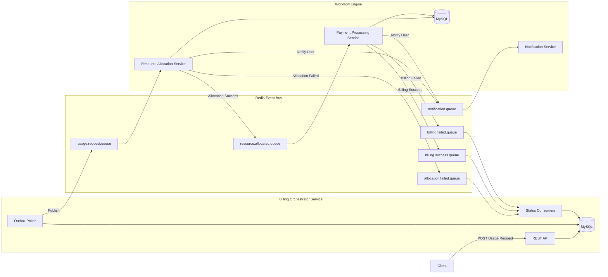

# QueueX — Event-Driven Credit Allocation & Billing Platform

A production-grade distributed workflow platform built with Spring Boot, demonstrating event-driven architecture, the outbox pattern, idempotency, saga compensation, and asynchronous billing workflows across independently deployed services.

> QueueX models a B2B usage-based billing platform where requests consume resources, trigger automated billing, and progress through asynchronous workflows with reliability guarantees.

**Worker service repo:** https://github.com/KeyurWarkhedkar/queue-x-workers

---

# Architecture Overview



---

# Request Lifecycle

```text
Client
 ↓
POST /usage-requests
 ↓
Billing Orchestrator Service
 ↓
usage.request.queue
 ↓
Resource Allocation Service
 ↓
resource.allocated.queue
 ↓
Payment Processing Service
 ↓
billing.success.queue OR billing.failed.queue
 ↓
Billing Orchestrator Service
 ↓
Final Request State
```

---

# Key Design Decisions

## Transactional Outbox Pattern

Usage requests and outbox events are written in the same database transaction.

This guarantees:

* No lost events
* Reliable publication after commit
* Safe recovery after crashes

The outbox poller later publishes events to Redis.

---

## Idempotency Everywhere

Client retries are handled through a unique constraint on:

```text
idempotency_key
```

Worker services use blind inserts into idempotency tables backed by unique constraints.

This prevents duplicate:

* Usage requests
* Resource allocations
* Billing executions
* Notifications

---

## Saga Compensation

Resource allocation occurs before billing.

If billing ultimately fails:

```text
Allocate Resources
        ↓
Attempt Billing
        ↓
Billing Failed
        ↓
Compensating Action
        ↓
Release Resources
```

This avoids refund workflows and keeps resource state consistent.

---

## Race Condition Safety

Concurrent requests with the same idempotency key are handled through database constraints rather than application-level existence checks.

The database acts as the final source of truth.

---

## SKIP LOCKED Polling

Outbox rows are fetched using:

```sql
SELECT ... FOR UPDATE SKIP LOCKED
```

This allows multiple pollers to operate safely without processing the same row twice.

---

# Tech Stack

* Java 21
* Spring Boot 3
* MySQL
* Redis
* Spring Data JPA
* Hibernate
* Spring Scheduling
* K6

---

# API

## POST /usage-requests

Creates a new usage request and immediately returns.

Resource allocation and billing happen asynchronously.

### Request

```json
{
  "userId": 1,
  "resourceId": 1,
  "quantity": 2,
  "idempotencyKey": "unique-client-generated-uuid"
}
```

### Response

```json
{
  "requestId": 123,
  "status": "PENDING",
  "message": "Request submitted successfully"
}
```

---

## GET /usage-requests/{id}

Returns current workflow state.

### Response

```json
{
  "requestId": 123,
  "status": "COMPLETED"
}
```

Possible states:

```text
PENDING
COMPLETED
FAILED
```

---

# Database Schema

```text
usage_requests
  id
  user_id
  resource_id
  quantity
  amount
  status
  idempotency_key
  created_at
  updated_at

outbox_event
  id
  request_id
  event_type
  status
  retry_count
  created_at

idempotency_records
  id
  message_id
  request_id
  created_at
```

---

# Load Test Results

Tested using K6 with 100 concurrent virtual users over 2 minutes.

| Metric         | Result       |
| -------------- | ------------ |
| Throughput     | 46.8 req/sec |
| Median Latency | 32 ms        |
| P90 Latency    | 66 ms        |
| P95 Latency    | 82 ms        |
| Error Rate     | 0.00%        |
| Total Requests | 6,110        |

## Consistency Verification

| Check                                 | Result    |
| ------------------------------------- | --------- |
| Requests stuck in PENDING             | 0         |
| COMPLETED requests                    | 201       |
| FAILED requests                       | 8         |
| Outbox Published                      | 209 / 209 |
| Duplicate requests                    | 0         |
| Billing status matched workflow state | 100%      |
| Resource allocation consistency       | 100%      |
| Cross-DB consistency                  | Perfect   |

Every request reached a terminal state with zero duplicates and no data inconsistencies.

---

# Related

queue-x-workers — Workflow Engine (Resource Allocation, Billing, Notifications)
